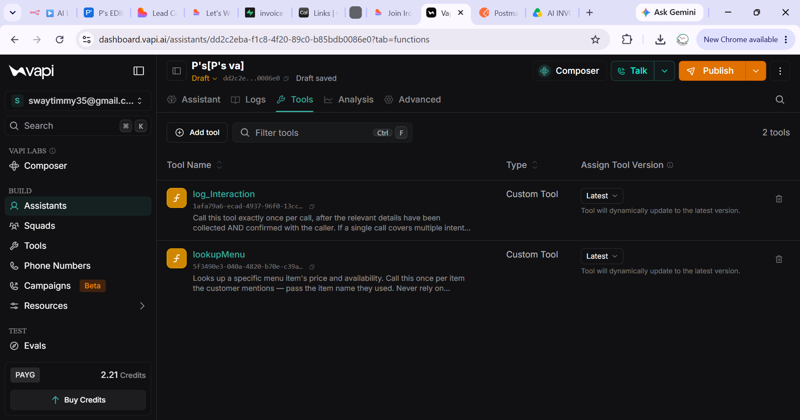
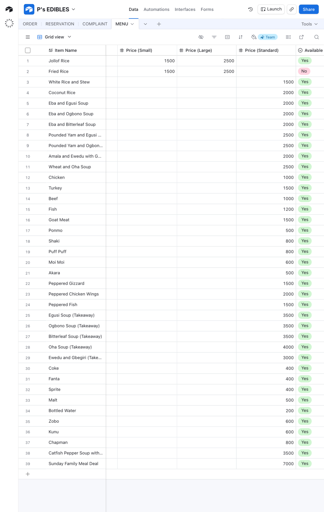
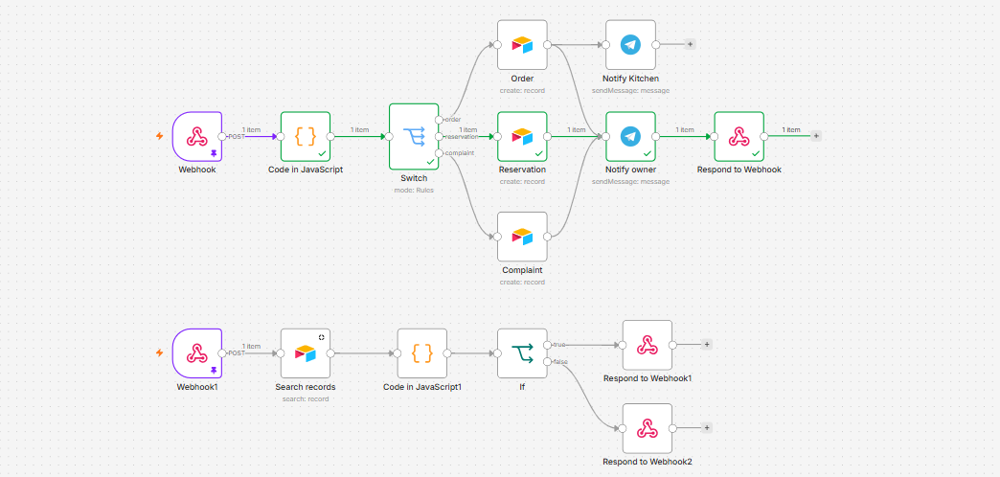
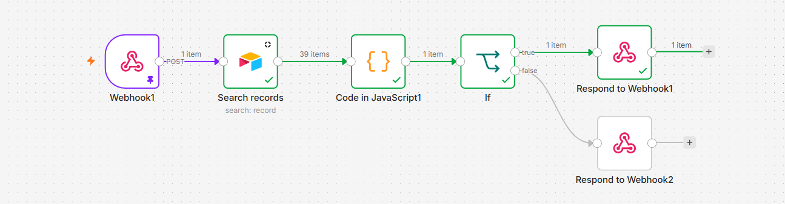
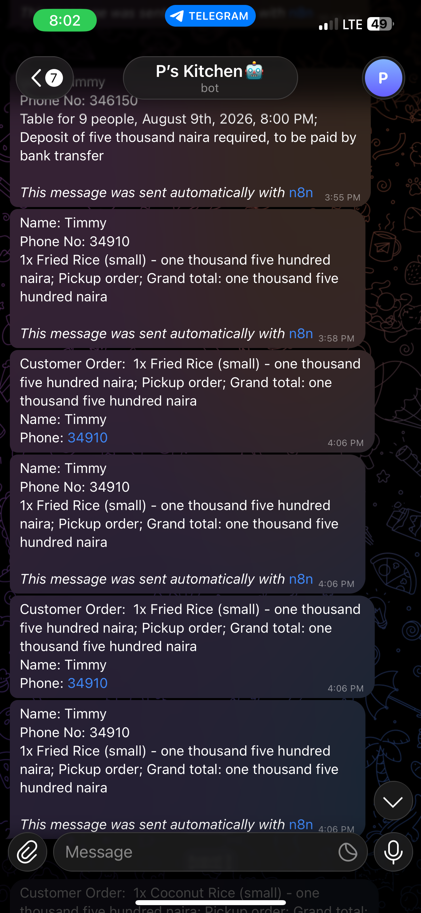

# Restaurant AI Receptionist with Live Menu Lookup

An AI-powered voice receptionist designed to automate customer interactions for restaurants.
The system answers incoming calls, handles frequently asked questions, takes food orders, records table reservations, logs customer complaints, and retrieves live menu information from Airtable.
Unlike traditional scripted voice bots that rely on hardcoded information, this system connects the AI receptionist to a live restaurant menu database, allowing staff to update dishes, prices, and availability without modifying the AI prompt.
Tech Stack: `Vapi` · `OpenAI GPT-4o` · `n8n` · `Airtable` · `Telegram` · `Webhooks` · `JavaScript`

---

## 📌 Problem
Restaurants often struggle to handle every incoming call during busy periods.
Missed calls can result in:
- Lost food orders
- Unanswered customer enquiries
- Missed reservation requests
- Delayed complaint handling
- Increased workload for restaurant staff
Traditional AI voice assistants can also rely on static information stored inside their prompts. This creates another problem: when a menu item becomes unavailable or a price changes, the AI may continue providing outdated information.
The goal of this project was to build an AI receptionist that could handle customer interactions while accessing **live restaurant data in real time**.

---

## 🎯 Objectives
The system was designed to:
- Automate restaurant phone calls using conversational AI
- Answer common restaurant enquiries
- Handle food orders
- Record table reservations
- Log customer complaints
- Retrieve menu information from a live Airtable database
- Check menu-item availability in real time
- Inform customers when dishes are unavailable
- Suggest alternative menu options when appropriate
- Automatically notify restaurant staff about customer interactions
- Reduce missed calls and manual administrative work
- Keep menu information independent from the AI prompt

---

## 💡 Solution
A **Vapi AI voice assistant** acts as the restaurant's virtual receptionist.
The assistant communicates with an **n8n automation workflow through webhooks** and can route different customer requests to the appropriate process.
For menu-related questions, the AI uses a **Vapi Custom Tool** to query the restaurant's Airtable menu database.
The workflow:
1. Receives the menu lookup request through a webhook.
2. Searches Airtable for the requested menu item.
3. Processes the result using JavaScript.
4. Returns a structured response to Vapi.
5. Allows the AI assistant to respond naturally to the customer.
This means restaurant staff can update menu items, prices, and availability directly in Airtable without modifying the AI prompt or rebuilding the workflow.
For orders, reservations, and complaints, the assistant collects the required information and sends it through n8n, where the request is routed to the appropriate workflow and stored in Airtable.
Restaurant staff receive instant Telegram notifications when relevant customer interactions are recorded.

---

## 🏗️ Workflow Architecture
### Customer Interaction & Menu Lookup
```
Customer
   ↓
Vapi Voice Assistant
   ↓
Determine Customer Intent
   ↓
   ├───────────────┐
   │               │
   ▼               ▼
General FAQ     Menu Lookup
                   ↓
               Vapi Tool
                   ↓
                Webhook
                   ↓
             Airtable Search
                   ↓
           JavaScript Formatter
                   ↓
            Respond to Webhook
                   ↓
          Vapi receives result
                   ↓
        AI responds naturally
```

Order, Reservation & Complaint Flow
```
Customer
   ↓
Vapi AI Assistant
   ↓
Collect Information
   ↓
Confirm Details
   ↓
Webhook
   ↓
n8n Workflow
   ↓
Switch / Route by Intent
   ↓
┌──────────┬─────────────┬────────────┐
│          │             │
▼          ▼             ▼
Order   Reservation   Complaint
│          │             │
└──────────┴─────────────┘
             ↓
      Create Airtable Record
             ↓
      Telegram Notification
             ↓
      Return Confirmation
             ↓
          Customer
```

⸻

🛠️ Technologies Used

Vapi:	AI voice assistant and conversational interface
OpenAI GPT-4o:	Natural language understanding and response generation
n8n:	Workflow automation and request routing
Airtable:	Live menu database and customer interaction records
Telegram Bot API:	Real-time notifications for restaurant staff
Webhooks:	Communication between Vapi and n8n
JavaScript:	Data processing and webhook response formatting

⸻

🧠 Core Features

🎙️ AI Voice Receptionist

Handles incoming customer conversations using a natural conversational voice interface.

🍽️ Live Menu Lookup

The AI can query the restaurant’s live Airtable menu instead of relying on hardcoded menu information.

✅ Real-Time Availability

The system checks whether requested dishes are currently available before providing information or proceeding with an order.

🔄 Alternative Recommendations

When a requested dish is unavailable, the AI can suggest suitable alternatives from the available menu.

🛒 Order Handling

The assistant collects customer order information and automatically records it in Airtable.

📅 Reservation Handling

Customers can provide reservation details through the voice assistant, with the information automatically recorded for restaurant staff.

📝 Complaint Logging

Customer complaints are captured and stored automatically rather than requiring staff to manually document them.

📲 Staff Notifications

Telegram notifications keep restaurant staff informed about relevant customer interactions in real time.

🔗 Vapi Custom Tool Integration

A custom Vapi tool allows the AI assistant to retrieve external data from the restaurant’s live menu database during a conversation.

⸻

🧩 Challenges Encountered

- Designing conversational flows that avoid repetitive questioning
- Preventing duplicate webhook executions during customer interactions
- Building a Vapi Custom Tool capable of querying a live Airtable menu
- Correctly formatting webhook responses so Vapi could process tool results
- Distinguishing unavailable dishes from menu items that do not exist
- Allowing restaurant staff to manage menu information without modifying AI prompts
- Maintaining reliable communication between Vapi, n8n, and Airtable
- Returning useful menu information in a format the AI could understand and communicate naturally

⸻

🔧 Improvements Made

- Replaced the hardcoded menu with a live Airtable database
- Added real-time menu lookup using Vapi Custom Tools
- Implemented menu availability checking
- Added intelligent responses for unavailable or non-existent dishes
- Enabled alternative menu recommendations
- Automated Telegram notifications for restaurant staff
- Improved conversational flow to reduce unnecessary questions
- Structured webhook responses to comply with Vapi Custom Tool requirements

⸻

📊 Results

The completed system can:

- Answer customer enquiries through natural voice conversations
- Retrieve live menu information from Airtable
- Confirm dish availability in real time
- Suggest alternative menu items when necessary
- Record food orders automatically
- Record table reservations
- Log customer complaints
- Store customer interactions in Airtable
- Send instant Telegram notifications to restaurant staff
- Keep menu information synchronized without modifying AI prompts

The result is an AI-powered restaurant receptionist that combines voice AI, tool calling, workflow automation, and live database access to automate a significant portion of the restaurant’s customer communication process.

⸻

📸 Screenshots

### Vapi AI Assistant & Custom Tool



### Live Airtable Menu



### n8n Automation Workflow



### n8n Automation Live Menu Lookup Workflow 



### Telegram Kitchen Notification



⸻

🎥 Demo

A full walkthrough demonstrating the AI receptionist, live menu lookup, order handling, reservation flow, complaint handling, and staff notifications.

Demo: [Resturant AI receptionist with Live Menu Lookup Demo Video](https://www.loom.com/share/1809bff28b6b4377af91ce5068f9288d)

⸻

🔮 Future Improvements

- WhatsApp ordering integration
- Customer order-status tracking
- Automated payment verification
- CRM integration for returning customers
- Customer order history and preferences
- Voice analytics and conversation reporting
- Automated post-order customer follow-up

⸻

📚 Key Learnings

- Voice AI development with Vapi
- AI tool calling and external data retrieval
- Webhook-based integrations
- n8n workflow automation
- Airtable database integration
- JavaScript data processing
- Structured webhook responses
- Real-time data retrieval during AI conversations
- Designing conversational automation workflows

⸻

👤 Author

Hammed Timmy

AI & Automation Builder

[LinkedIn](https://www.linkedin.com/in/okanlawon-a-o/)⁠
